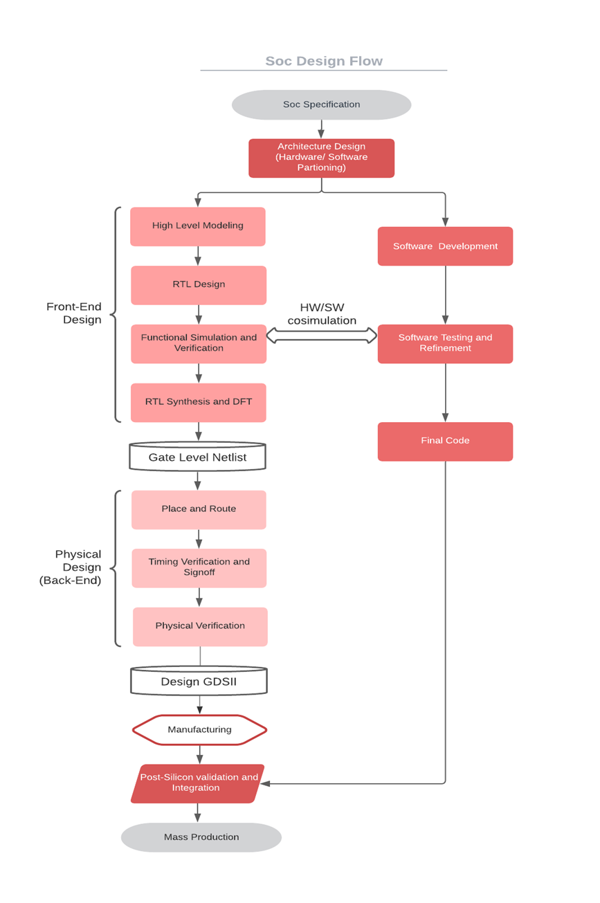
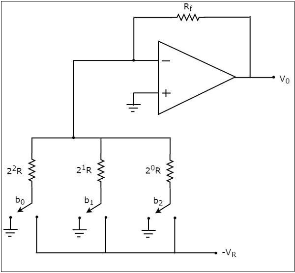

# WEEK\_2\_RISC\_V\_SOC\_TAPEOUT\_PROGRAM\_VSD
---
## Week 2 Task – BabySoC Fundamentals & Functional Modelling

**Objective:**
To build a solid understanding of SoC fundamentals and practice functional modelling of the BabySoC using simulation tools ($\text{Icarus Verilog}$ & $\text{GTKWave}$).

**Focus on:**
* What is a System-on-Chip ($\text{SoC}$)?
* Components of a typical $\text{SoC}$ ($\text{CPU}$, memory, peripherals, interconnect).
* Why $\text{BabySoC}$ is a simplified model for learning $\text{SoC}$ concepts.
* The role of functional modelling before $\text{RTL}$ and physical design stages.

---
## System-on-Chip (SoC):  
**Overview:**  

A **System-on-Chip (SoC)** is a complete electronic system built onto a single integrated circuit (chip). It integrates all necessary components—the processor, memory, and communication tools—into one compact package. This integration makes devices **smaller, faster, and more power-efficient**.

***

### 1. What is a System-on-Chip (SoC)? 

An $\text{SoC}$ is a "mini-computer" on a single die. Its main purpose is to serve as the core processor for modern electronic devices where **Space, Power, and Efficiency** are critical (e.g., smartphones, smartwatches, $\text{IoT}$ gadgets).

* **Integration:** Consolidates multiple functional blocks (like $\text{CPU}$, $\text{GPU}$, $\text{Memory}$, $\text{I/O}$) onto one silicon chip.
* **Key Benefits:** Drastically reduces the physical size, lowers power consumption (crucial for battery life), and improves overall processing speed due to shorter data travel paths.

***

### 2. Components of a Typical SoC 

A typical $\text{SoC}$ combines various functional blocks that work together to create a complete, functioning system, encompassing both general processing and specialized tasks:

| Component | Simple Description | Function in the SoC |
| :--- | :--- | :--- |
| **CPU (Central Processing Unit)** | The **Brain** of the system. | Executes all general-purpose instructions, runs the operating system, and manages applications. Modern SoCs often feature multi-core designs (e.g., $\text{RISC-V}$ cores). |
| **Memory** | **Storage** for data and instructions. | Includes high-speed **SRAM** (for cache/registers) and **DRAM** or **Flash** (for main, volatile, or non-volatile storage). |
| **Interconnect (Bus/NoC)** | The **Internal Road System** (like an $\text{AXI}$ Bus or $\text{Network-on-Chip}$). | Enables high-speed, reliable communication and data exchange between all the individual components on the chip. |
| **Peripherals & I/O** | **Interfaces and Specialized Handlers** that connect the $\text{SoC}$ to the external world. | Includes specialized processing units like the **GPU** (for graphics) and **DSP** (for audio/video), as well as standard communication interfaces ($\text{USB}$, $\text{HDMI}$, $\text{UART}$, $\text{SPI}$, etc.). |
| **Power Management Unit (PMU)** | Regulates and distributes power across the chip, ensuring components operate efficiently and extending battery life. |
| **Special Features / IP Blocks** | **Additional, dedicated modules** that vary by product purpose. | Includes modules like **Wi-Fi, Bluetooth, security cores, cryptography engines,** and **AI accelerators** (or dedicated hardware for machine learning). |
| **Clock & Timing Units** | **System timing control.** | Manages system timing, often using integrated **PLL ($\text{Phase-Locked Loops}$),** ensuring synchronous and accurate operation of the $\text{CPU}$, memory, and peripherals. |
| **Analog Components / DACs** | **Digital-to-Analog Converters.** | Converts digital signals into analog output for audio, video, or interfacing with external analog sensors and devices. |

***

### 3. Types of System-on-Chip (SoC) Architectures 

SoCs are often categorized based on the complexity of their core processor and their intended application:

| SoC Type | Core Component | Primary Application & Characteristics |
| :--- | :--- | :--- |
| **Microcontroller-based** | **Microcontroller ($\text{MCU}$)** | Designed for **simple control tasks, low power, and high efficiency.** Ideal for systems with minimal processing needs. **Examples:** $\text{IoT}$ sensors, basic smart appliances. |
| **Microprocessor-based** | **Microprocessor ($\mu$P)** | Built to handle **demanding tasks and run complex Operating Systems ($\text{OS}$).** Provides higher general performance and multi-tasking capabilities. **Examples:** Smartphones, tablets, advanced computing devices. |
| **Application-Specific** | **Highly Optimized Core(s)** | **Custom-designed for a single, high-performance task.** Optimized for maximum speed and efficiency in a specific domain. **Examples:** Dedicated Graphics Cards ($\text{GPUs}$), $\text{AI}$/Machine Learning accelerators. |

***
 

---
## VSDBabySoC (BabySoC) Overview

The **VSDBabySoC (BabySoC)** is a small, highly efficient **System-on-Chip (SoC)** primarily designed as an **educational platform** for embedded systems and mixed-signal (digital-analog) interfacing. Built using $\text{Sky130}$ technology, its key objective is to facilitate simultaneous testing of open-source $\text{IP}$ cores and analog component calibration.

***

### 1. Key Components of BabySoC 

The $\text{BabySoC}$ is a mixed-signal system, integrating essential digital and analog blocks:

| Component | Type | Function |
| :--- | :--- | :--- |
| **RVMYTH Microprocessor** | Digital ($\text{RISC-V CPU}$) | The central **processing unit and brain**. Handles all computational tasks, executes instructions, and, critically, **prepares and cycles data** for the $\text{DAC}$ (specifically using the `r17` register). |
| **8x Phase-Locked Loop (PLL)** | Analog/Mixed-Signal | Generates a **stable and synchronized clock signal**. This is vital for coordinating the operation of the $\text{RVMYTH CPU}$ and the $\text{DAC}$, ensuring all components operate in harmony and maintain data integrity. |
| **10-bit Digital-to-Analog Converter (DAC)** | Analog | Receives digital data from the $\text{RVMYTH}$ processor and converts it into a continuous **analog output signal**. This block facilitates the system's external interfacing capabilities. |

***
  
  

### 2. BabySoC Functionality and Role 

The $\text{BabySoC}$'s function centers on digital data processing for analog signal generation:

* **Initialization & Clock Synchronization:** The $\text{SoC}$ begins by activating the **PLL** upon receiving an initial input. The $\text{PLL}$'s synchronized clock ensures precise, simultaneous operation between the $\text{RVMYTH}$ core and the $\text{DAC}$.
* **Data Processing ($\text{RVMYTH}$):** The $\text{RVMYTH}$ core continuously processes and updates values stored in its **$\text{r17}$ register**. This process creates a continuous digital data stream for analog conversion.
* **Analog Output Generation ($\text{DAC}$):** The $\text{DAC}$ takes the data from `r17` and converts it into an analog signal. This output is stored in a file (named **OUT** in the example) and can drive **multimedia outputs** (audio or video) when connected to external consumer electronics like TVs or mobile phones.
* **Educational Focus:** The platform's highly documented nature makes it an ideal environment for students and engineers to learn about modern embedded system design, $\text{RISC-V}$ architecture, and fundamental digital-analog interfacing.

***
---
## Why BabySoC is a Simplified Model for Learning SoC Concepts 

The **VSDBabySoC (BabySoC)** is an ideal, simplified platform for learning complex System-on-Chip ($\text{SoC}$) concepts because it focuses on a **minimal but complete** set of functionality, effectively demonstrating core principles without the overwhelming complexity of a commercial chip.

1.  **Minimal Component Set:** Commercial SoCs have dozens of complex $\text{IP}$ blocks (multi-core $\text{CPUs}$, multiple $\text{GPUs}$, large memory controllers, etc.). $\text{BabySoC}$ features only **three core components** ($\text{RVMYTH CPU} + \text{PLL} + \text{DAC}$), allowing learners to focus on how a small number of essential digital and analog blocks integrate and communicate.
2.  **Clear Interfacing:** It provides a direct, easy-to-trace example of **digital-to-analog interfacing**. The flow of data from the digital $\text{CPU}$ register (`r17`) to the analog output is simple, concrete, and measurable, making the concept of mixed-signal integration highly accessible.
3.  **Educational Objective:** Unlike commercial chips designed for mass market performance, $\text{BabySoC}$ was explicitly designed as an **educational platform** built on open-source technology ($\text{Sky130}$), meaning its documentation, verification environment, and internal workings are transparent and easy to analyze.

***

## The Role of Functional Modeling in SoC Design 

**Functional modeling** (or system-level modeling) is the crucial first step in the $\text{SoC}$ design flow, performed **before** the Register-Transfer Level ($\text{RTL}$) and physical design stages.

Functional modeling defines *what* the chip must do, while $\text{RTL}$ and physical design determine *how* it will do it in hardware.

| Stage | Purpose | Description |
| :--- | :--- | :--- |
| **Functional Modeling (Initial Stage)** | **High-Level Verification of System Behavior** | This stage uses high-level programming languages ($\text{C} / \text{C}++$, Python, or specialized system languages) to quickly model the **expected behavior** and **algorithms** of the entire $\text{SoC}$. It verifies that the architecture, communication protocols, and overall data flow *conceptually* work before investing time in detailed hardware description. |
| **RTL Design (Intermediate Stage)** | **Hardware Implementation** | Translates the verified functional model into hardware description languages ($\text{Verilog}$ or $\text{VHDL}$), defining the actual structure and timing of digital circuits (e.g., flip-flops, registers, logic gates). |
| **Physical Design (Final Stage)** | **Silicon Layout** | Transforms the $\text{RTL}$ code into the physical layout ($\text{GDSII}$ file) for manufacturing, including placement, routing, and timing closure. |

### Importance Before RTL and Physical Design:

1.  **Early Bug Detection:** It is significantly **faster and cheaper** to find and fix architectural or algorithmic errors in a software model than to fix them in $\text{RTL}$ code or, worse, after the chip has been manufactured ($\text{Tapeout}$).
2.  **Architectural Exploration:** It allows designers to rapidly evaluate different system architectures (e.g., how many processors to use, which bus to select) and performance trade-offs without writing extensive hardware code.
3.  **Specification Validation:** Ensures the system specification (the requirements document) is correctly interpreted and implemented before moving to the detailed, time-consuming hardware design phases.

---
## VSDBabySoC Modeling and Simulation Plan

The primary goal of this stage is to functionally model and simulate the **VSDBabySoC** using industry-standard open-source tools ($\text{Iverilog}$ and $\text{GTKWave}$). This process verifies the integration and synchronous operation of the core $\text{IP}$ blocks before proceeding to the physical design flow.

### Simulation Flow Overview 

The simulation setup involves four main elements: three $\text{IP}$ cores and a wrapper, all driven by a $\text{Testbench}$ module.

1.  **Initial Signal Input:** The $\text{Testbench}$ feeds initial input signals to the `vsdbabysoc` wrapper.
2.  **Clock Generation:** The **PLL** is activated and begins generating a stable, synchronized $\text{CLK}$ signal.
3.  **Instruction Execution:** The $\text{CLK}$ signal drives the **RVMYTH** core, which executes instructions stored in its $\text{IMEM}$.
4.  **Data Cycling:** $\text{RVMYTH}$ sequentially fills its **$\text{r17}$ register** with digital values.
5.  **Analog Conversion:** The **DAC** receives the digital values from $\text{r17}$ and converts them into the final **analog output signal, $\text{OUT}$**.

The entire system is captured and visualized using $\text{Iverilog}$ (for simulation) and $\text{GTKWave}$ (for waveform viewing).

***

### Modeling the IP Cores 

The $\text{SoC}$ integrates a mix of digital and analog/mixed-signal $\text{IP}$ cores, modeled as follows:

| IP Core | Description | Modeling Language / Tool | Reference Repository |
| :--- | :--- | :--- | :--- |
| **RVMYTH Microprocessor** | Digital ($\text{RISC-V CPU}$) | Originally designed in **TL-Verilog** and converted to standard $\text{Verilog}$ using the **Sandpiper-SaaS** tool. | [shivanishah269/risc-v-core](https://github.com/shivanishah269/risc-v-core) |
| **10-bit DAC** | Analog | Modeled in $\text{Verilog}$ using the **`real` datatype** to simulate analog behavior, allowing functional verification. | [vsdip/rvmyth\_avsddac\_interface](https://github.com/vsdip/rvmyth_avsddac_interface) |
| **PLL (AVSDPLL)** | Analog/Mixed-Signal | Modeled in $\text{Verilog}$ using the **`real` datatype**. *Note: The initial model was updated to $\text{AVSDPLL}$ to ensure sufficiency for the physical design flow.* | Initial: [vsdip/rvmyth\_avsdpll\_interface](https://github.com/vsdip/rvmyth_avsdpll_interface) $\implies$ Final: [lakshmi-sathi/avsdpll\_1v8](https://github.com/lakshmi-sathi/avsdpll_1v8) |

**Digital-Analog Modeling Note:** Since standard $\text{Verilog}$ synthesis tools cannot process analog circuits, the $\text{PLL}$ and $\text{DAC}$ are functionally modeled using the $\text{Verilog}$ **`real` datatype** to simulate their behavior during the digital simulation phase.

***
