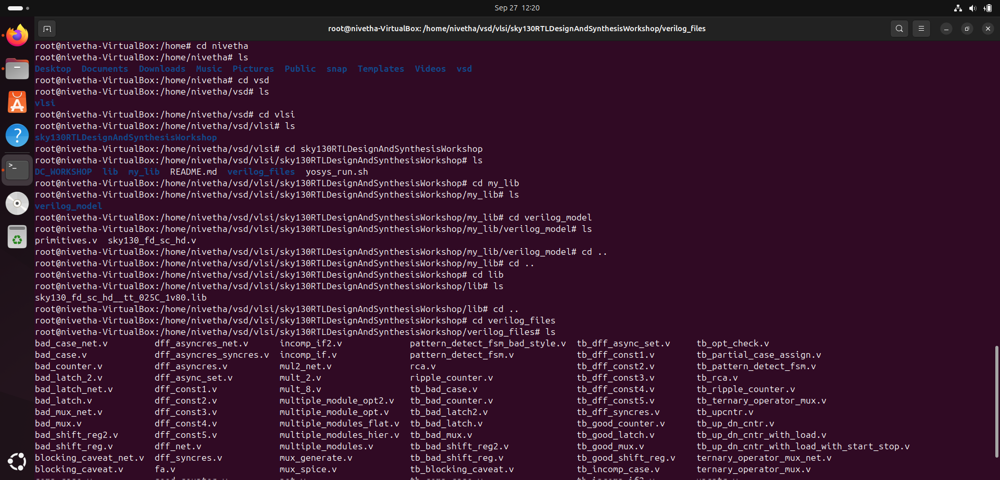
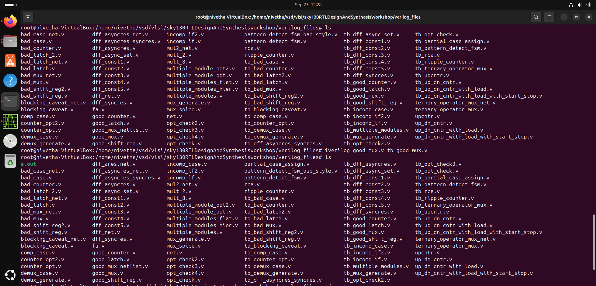
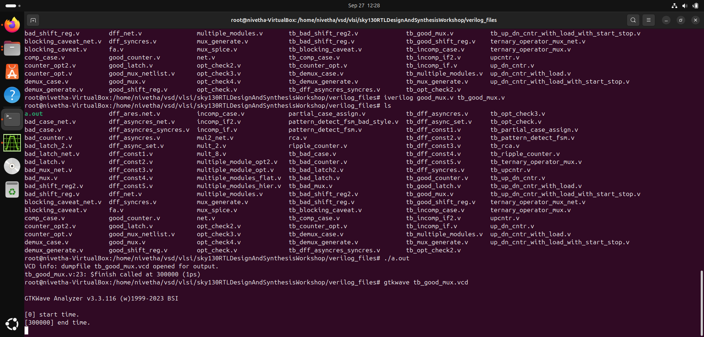
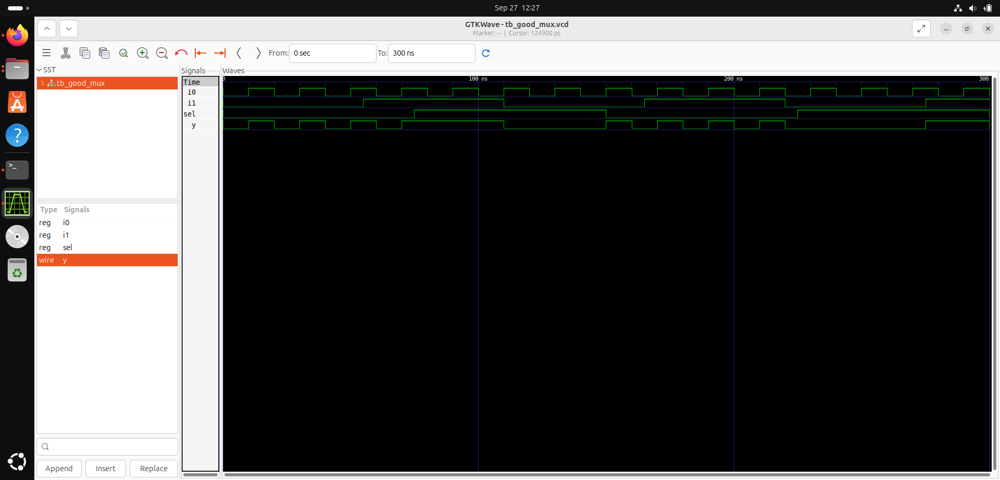

# Week 1, Day 1: Introduction to Icarus Verilog (Iverilog) Simulation Flow

This document outlines the basic concepts of Verilog design, testbenches, and the simulation flow using **Icarus Verilog (Iverilog)** and **GTKWave**.

## 1\. Core Concepts

### Simulator

  * A **Simulator** is the tool used for simulating and verifying a digital design.
  * **RTL (Register-Transfer Level)** design is checked for adherence to its specification by simulating the design.
  * In this workshop, we use the **Icarus Verilog (Iverilog)** simulator.

### Design

  * The **Design** is the actual Verilog code (or set of Verilog codes) that describes the intended functionality to meet the required specifications. This is often referred to as the **Device Under Test (DUT)**.

### Testbench

  * A **Testbench (TB)** is the setup used to apply **stimulus** (test vectors) to the Design to check its functionality.
  * **Key difference:**
      * The **Design** may have one or more primary inputs and one or more primary outputs.
      * The **Testbench** itself generally does not have primary inputs or primary outputs; its purpose is purely to test the Design.

## 2\. How the Simulator Works

The simulator's fundamental operation is based on monitoring signal changes over time:

  * The simulator looks for **changes** on the input signals.
  * Upon a change to an input, the output of the design is **evaluated** (recalculated).
  * If there is **no change** to the input, there is typically **no change** to the output (unless the design is stateful, which is handled by internal clock events).
  * *In essence, the simulator is driven by events (changes in signal values).*

## 3\. Iverilog-based Simulation Flow

The typical flow for simulating a Verilog design using Iverilog is as follows:

1.  The **Design** file and the **Testbench** file are compiled by the **Iverilog simulator**.
2.  During simulation, the simulator monitors the design's signals. Signal activity (specifically, value changes) is dumped into a file called a **VCD (Value Change Dump)** file.
3.  To view the design's output and signal activity in a graphical format (as a waveform), the **GTKWave** tool is used to open the VCD file.

|  |
| :---: |

-----

## 4\. Setup and Execution Steps (VSD Flow)

These steps detail how to clone the necessary workshop repository and run your first simulation.

1.  **Navigate and Clone the Repository:**

      * Create a directory for your VLSI work and navigate into it.
      * Clone the workshop repository from GitHub.

    <!-- end list -->

    ```bash
    # Assuming you are in the VSD folder
    mkdir vlsi
    cd vlsi
    # Need sudo/root access to clone to this location if it's restricted
    sudo -i 
    git clone https://github.com/kunalg123/sky130RTLDesignAndSynthesisWorkshop
    ```

2.  **Explore the Repository Structure:**

      * After cloning, navigate into the workshop directory.

    <!-- end list -->

    ```bash
    cd sky130RTLDesignAndSynthesisWorkshop
    ls 
    ```

      * **`my_lib`**: Contains custom library files.
      * **`lib`**: Contains the standard cell library used for synthesis.
      * **`verilog_models`**: Contains the Verilog models for standard cells.
      * **`verilog_files`**: Contains the source Verilog files and their testbenches for lab experiments.
        
        
3.  **Run Simulation and View Waveforms:**

      * Navigate to the experiment files.

    <!-- end list -->

    ```bash
    cd verilog_files 
    ```
    

       **Compile the Design and Testbench:** Iverilog compiles the two files and generates an executable output file named `a.out`.

    <!-- end list -->

    ```bash
    iverilog good_mux.v tb_good_mux.v
    ls # You will see the a.out file
    ```
    
  
     **Execute the Simulation:** Running the compiled file executes the testbench, which applies stimulus to the design and dumps the resulting signal activity into a VCD file.
  <!-- end list -->

     
    ./a.out 
    # This generates a VCD file (e.g., tb_good_mux.vcd)
  

  
       **View the Output Waveforms:** Use the GTKWave tool to analyze the VCD file.
    <!-- end list -->

     
    gtkwave tb_good_mux.vcd
    
   
      * The GTKWave GUI will open, allowing you to select signals and view the output as a waveform.

-----

**Acknowledgement:** Always add the acknowledgement.
