# Day 2: Timing Libs, Hierarchical vs. Flat Synthesis, and Efficient Flop Coding 
## 1\. Introduction to the Standard Cell Library (`.lib`)

The `.lib` file is the fundamental reference for the synthesis tool, defining all the physical building blocks for your chip.

### A. Understanding the Library Name

The library name, such as `sky130_fd_sc_hd__tt_025C_1v80.lib`, encodes the specific operating environment and cell type:

  * **`sky130`**: The foundry process technology (SkyWater 130nm).
  * **`fd_sc_hd`**: The specific type of cell library (**F**eedthrough, **S**tandard **C**ell, **H**igh **D**ensity).
  * **PVT Corner (`tt_025C_1v80`)**:
      * **P**rocess: **`tt`** (Typical-Typical, the nominal fabrication variation).
      * **V**oltage: **`1v80`** (1.80 Volts).
      * **T**emperature: **`025C`** (25 degrees Celsius).
   

### B. Library Content

The `.lib` file contains crucial data for every logic gate (cell):

  * **Technology/CMOS Type**: Defines the underlying silicon technology.
  * **Delay Look-up Tables**: Provides timing delay for the cell based on input transition time and output load capacitance.
  * **Cell Flavors**: The library contains different versions of the same logic function (e.g., `and2_0`, `and2_2`).
      * **Wider Cell (High Drive)**: Larger area, lower delay (faster), higher power consumption.
      * **Smaller Cell (Low Drive)**: Less area, higher delay (slower), lower power consumption.
        
 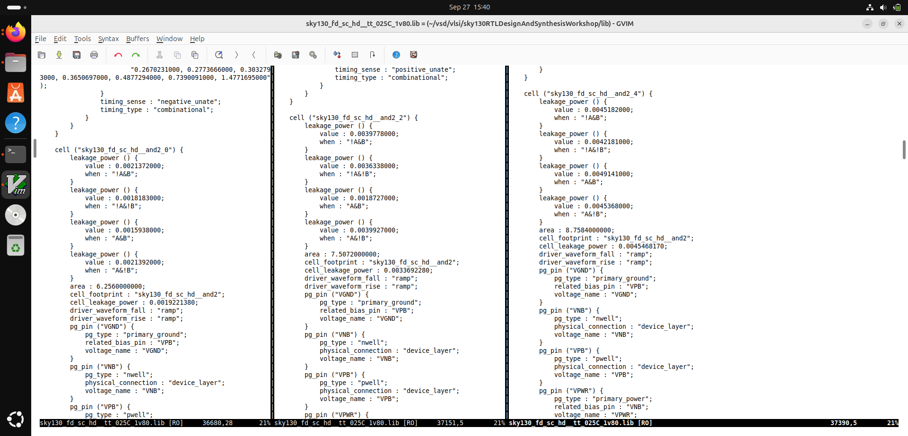  
 
-----

## 2\. Hierarchical vs. Flat Synthesis

This describes how the design structure is handled when translating Verilog (RTL) to a gate-level netlist.

### RTL Example ($y = (a \text{ AND } b) \text{ OR } c$):

```verilog
module multiple_modules (input a, input b, input c , output y);
    wire net1;
    sub_module1 u1(.a(a),.b(b),.y(net1)); // AND gate
    sub_module2 u2(.a(net1),.b(c),.y(y)); // OR gate
endmodule
```

  * **Hierarchical Synthesis**: The netlist maintains the boundaries of `sub_module1` and `sub_module2` as distinct blocks. It connects the modules rather than individual gates.
  * **Flat Synthesis**: The netlist collapses the hierarchy, treating the entire design as one set of logic. It produces the most optimized circuit (just one AND gate connected to one OR gate).
 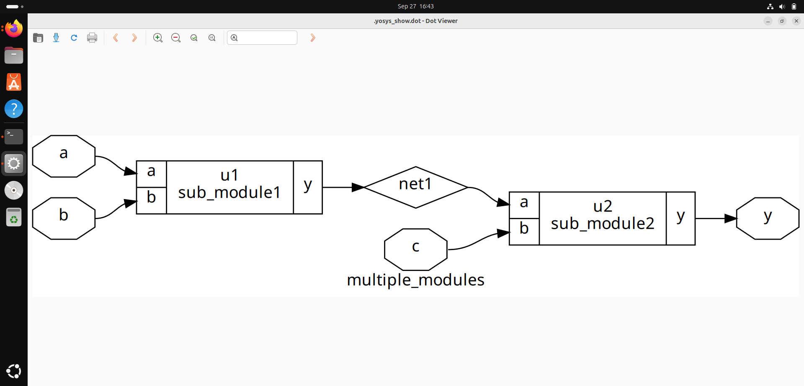
 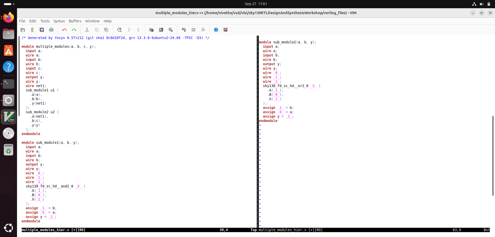
 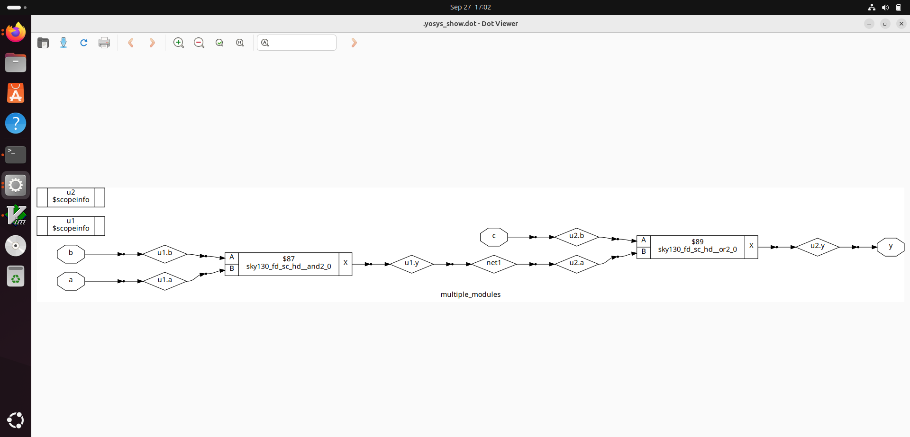
 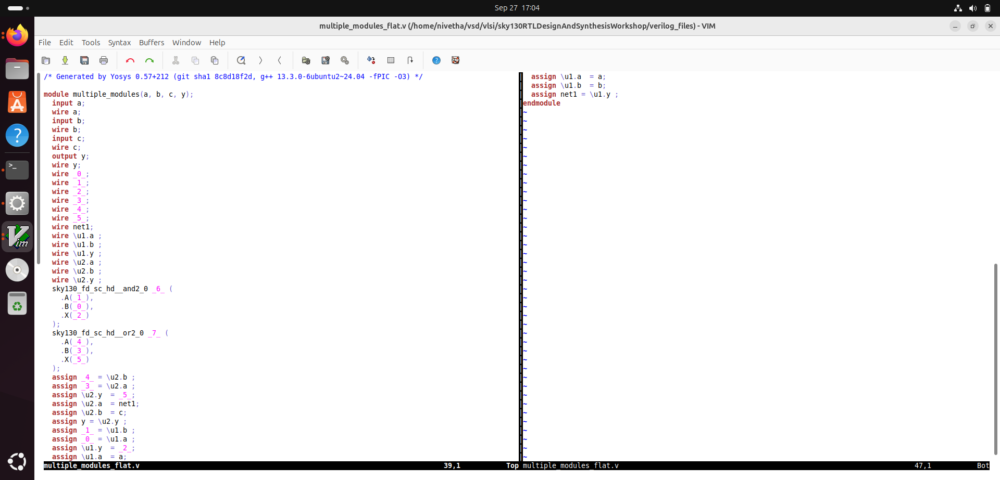
### Why We Need Sub-module Based RTL (Hierarchy)

The structure is used for **design management** and **productivity**, not primarily for final optimization.

  * **Code Reuse**: Use the same module multiple times in the design (instantiation) instead of writing or synthesizing the logic repeatedly.
  * **Complexity Management**: Essential for large chips, allowing engineers to divide the design into manageable, verifiable blocks.

-----

## 3\. Sequential Logic and Flip-Flops (DFF)

### Why We Need a Flip-Flop (DFF) in a Circuit

  * **To Prevent Hazards (Glitches)**: Combinatorial circuits can produce momentary, incorrect outputs (glitches) when inputs change due to different signal propagation delays.
  * **To Synchronize**: The DFF samples its input only on the active edge of the **clock**, holding the value and ignoring any glitches in the input data. This ensures all logic updates occur reliably and synchronously.
  * **Initialization**: DFFs require a synchronous or asynchronous **set** and **reset** to be initialized to a known state (0 or 1) upon power-up, avoiding **garbage values** (or 'X' states).

### DFF Synthesis Styles (Yosys Flow)

The four common DFF styles (`dff_asyncres.v`, `dff_syncres.v`, etc.) are mapped to specific library cells.

The typical **Yosys** command flow to generate the netlist for one style is:

```yosys
read_liberty -lib ../lib/sky130_fd_sc_hd__tt_025C_1v80.lib
read_verilog dff_asyncres.v
synth -top dff_asyncres
dfflibmap -liberty ../lib/sky130_fd_sc_hd__tt_025C_1v80.lib
abc -liberty ../lib/sky130_fd_sc_hd__tt_025C_1v80.lib
show # This command generates the output for the screenshot
```
 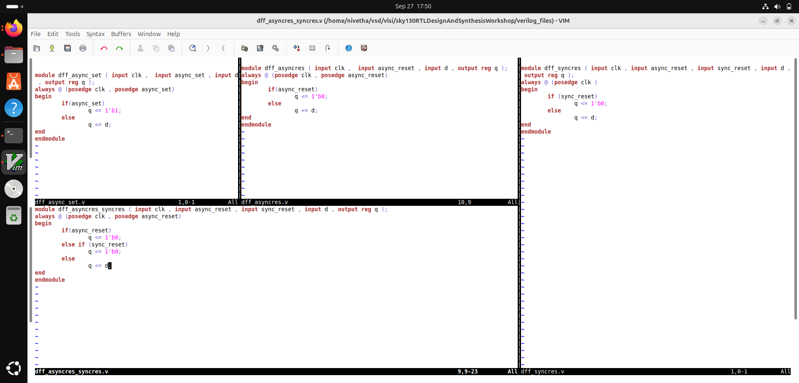
 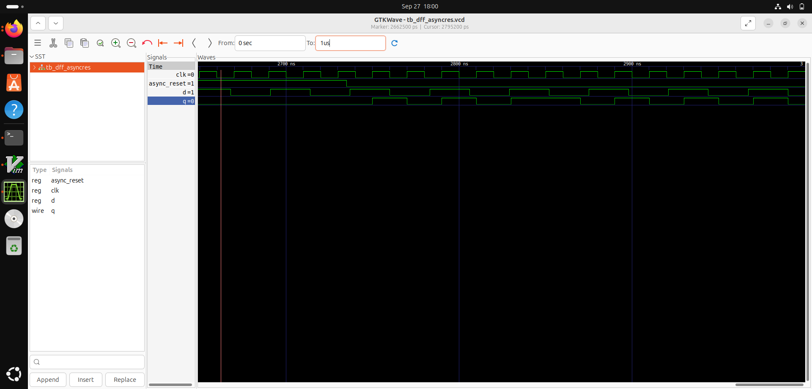
 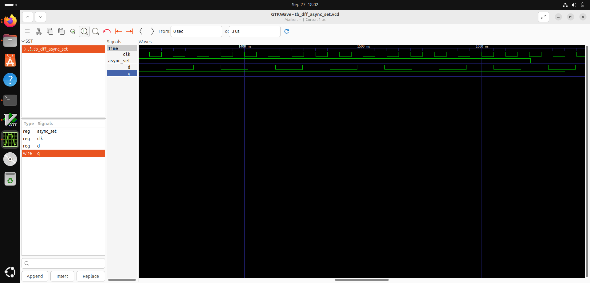
 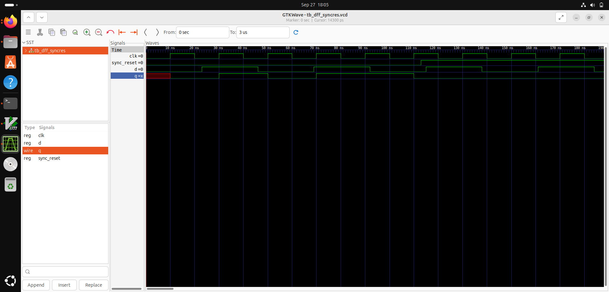
  
 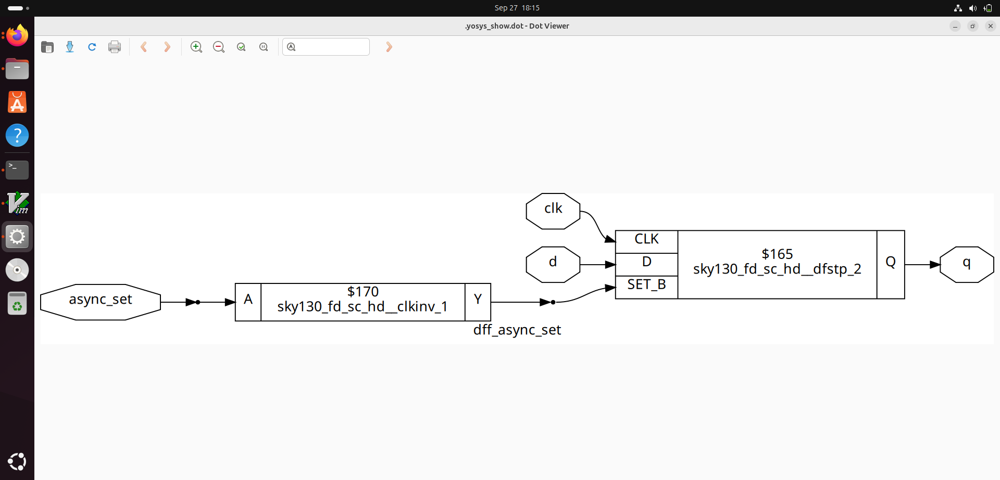
 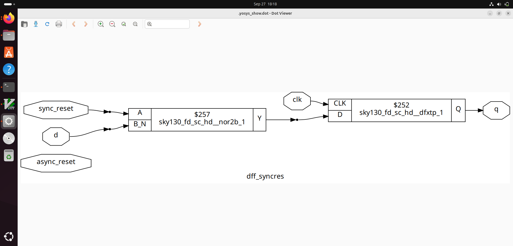
 

-----

## 4\. Arithmetic Optimization

The synthesis tool applies mathematical tricks to simplify arithmetic logic into efficient wiring and specialized blocks.

### Case 1: Multiplication by 2

  * **Concept**: $\text{num} \times 2$ is a simple **left shift** by one bit.
  * **Optimization**: Replaced a complex multiplier circuit with simple wiring connections and appending a zero to the least significant bit.
  * **Code for screenshot (Implicit in Yosys `show`):**
    ```verilog
    module mul2 (input [2:0] a, output [3:0] y);
        assign y = a * 2; 
    endmodule 
    ```
    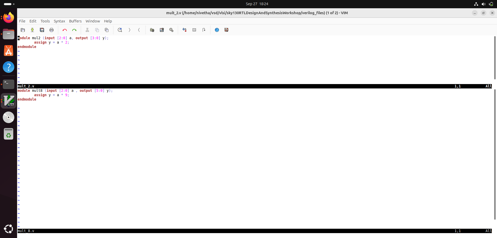
    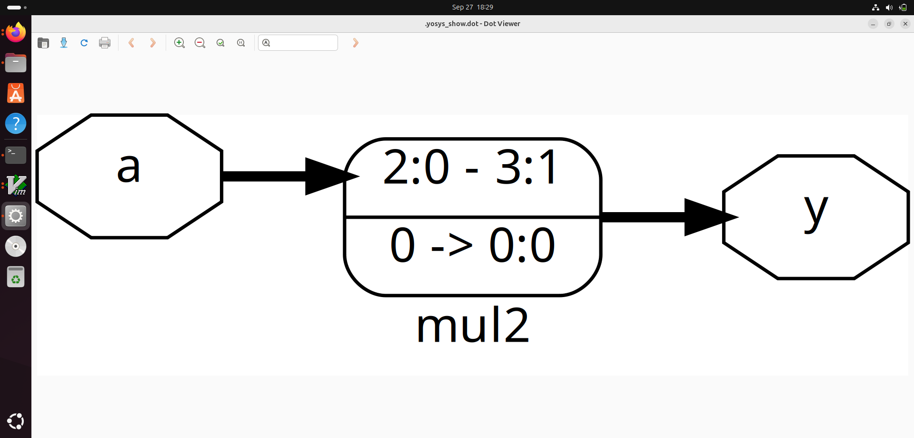
    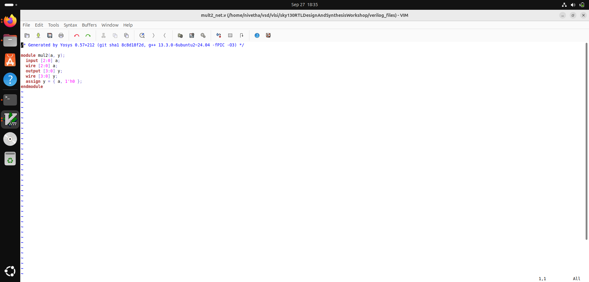

### Case 2: Multiplication by 9

  * **Concept**: $\text{num} \times 9 = (\text{num} \times 8) + \text{num}$.
  * **Special Case**: $\text{num} \times 8$ is a **left shift by three bits**.
  * **Optimization**: The tool replaces the multiplier with a **shift operation** (wiring) followed by an **adder** block.
  * **Code for screenshot (Implicit in Yosys `show`):**
    ```verilog
    module mul9 (input [3:0] a, output [7:0] y); 
        assign y = a * 9; 
    endmodule
    ```
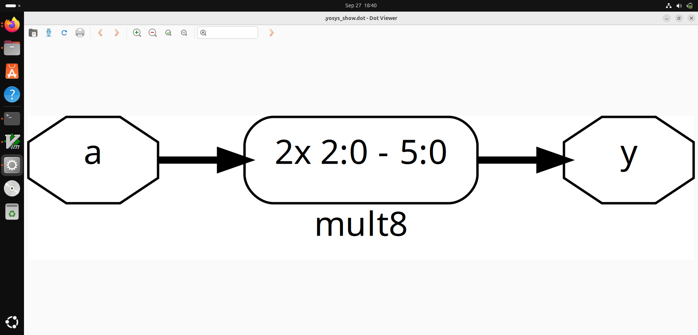
  

---  
