#  Day 3: Combinational and Sequential Optimization

This module focuses on techniques used by synthesis tools to simplify and reduce logic, leading to better **Area**, **Power**, and **Performance** (timing).

## Combinational Logic Optimization

**Goal:** Squeezing the logic to achieve the most optimized design in terms of gate count (Area) and reduced switching (Power).

  * **Constant Propagation (Direct Optimization):** Substituting a logic constant (`1'b0` or `1'b1`) for a signal wherever it appears in an expression. This often eliminates entire sections of logic.

      * **Example:** For $Y = (A \cdot B + C)'$:
          * If **$A=0$**, the expression simplifies to $Y = (0 \cdot B + C)' = (0 + C)' = \mathbf{C'}$.
          * In **CMOS technology**, this dramatically reduces transistor count (e.g., from 6 or more transistors for the complex gate to 2 for an inverter).

  * **Boolean Logic Optimization:** Applying theorems (like De Morgan's) and minimization techniques (like K-maps or Quine-McCluskey) to convert a complex expression into an equivalent, simpler one.

-----

## Sequential Logic Optimization

This optimization focuses on the state elements (Flip-Flops).

  * **Basic Optimization (Sequential Constant Propagation):** Eliminating Flip-Flops whose input is found to be a constant.
  * **Advanced Techniques (Not Covered in Detail):**
      * **State Optimization:** Optimizing FSMs by removing or merging unused/redundant states.
      * **Retiming:** Moving registers across combinatorial logic to balance clock path delays and improve frequency.
      * **Sequential Logic Cloning:** Used in advanced flows to improve placement and routing (Floor Plan Aware Synthesis).

The general Yosys command to apply optimization is:

```yosys
opt_clean -purge
```

-----

## Combinational Logic Optimization Lab Examples

The following examples show how complex RTL expressions are simplified by the Yosys optimization passes (`opt_clean`, `abc`).

| Verilog Module | Initial Expression | Optimized Expression | Final Logic |
| :--- | :--- | :--- | :--- |
| `opt_check1.v` | `assign y = a ? b : 0;` | $y = a \cdot b + a' \cdot 0$ | $\mathbf{y = a \cdot b}$ |
| `opt_check2.v` | `assign y = a ? 1 : b;` | $y = a \cdot 1 + a' \cdot b = a + a' \cdot b$ | $\mathbf{y = a + b}$ |
| `opt_check3.v` | `assign y = a ? (c ? b : 0) : 0;` | $y = a \cdot (c \cdot b + c' \cdot 0) + a' \cdot 0$ | $\mathbf{y = a \cdot c \cdot b}$ |
| `opt_check4.v` | `assign y = a ? (b ? (a & c) : c) : (!c);` | $y = a \cdot c + a' \cdot c'$ | $\mathbf{y = a \text{ XNOR } c}$ |  


### Example 4: `opt_check4.v` Netlist

The final optimized expression is $y = a \cdot c + a' \cdot c'$, which is the $\text{XNOR}$ function.

```verilog
module opt_check4 (input a , input b , input c , output y);
    assign y = a?(b?(a & c ):c):(!c);
endmodule
```

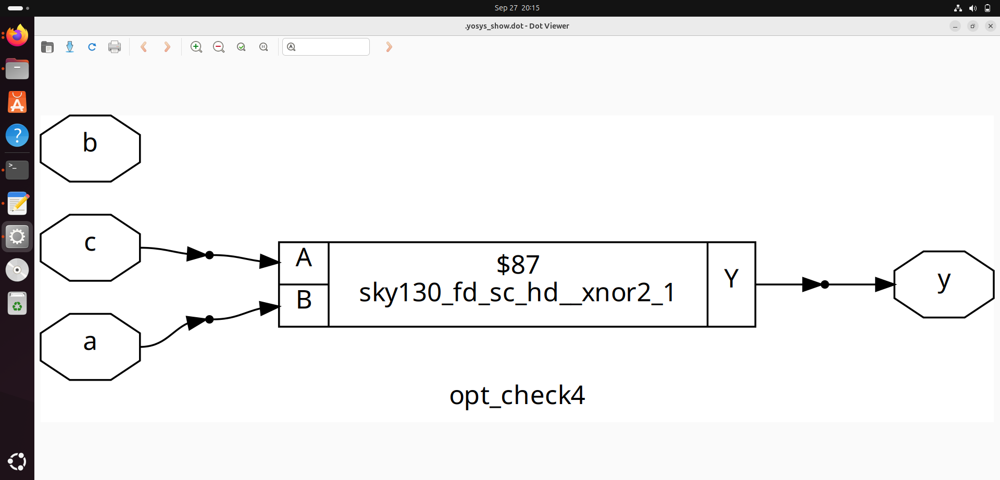
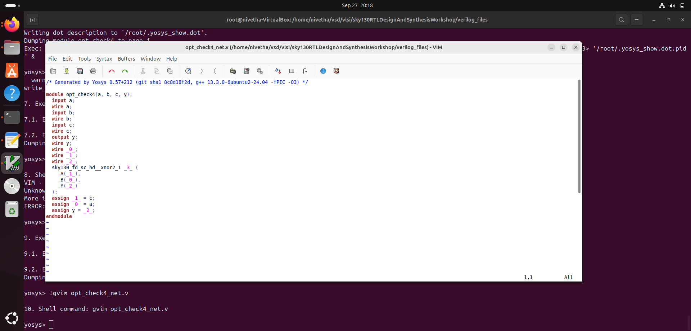

### Example 5: `multiple_module_opt.v` (Constant Propagation & Logic)

The constants are propagated, simplifying module outputs and the top-level expression.

```verilog
module sub_module1(input a , input b , output y);
    assign y = a & b;
endmodule

module sub_module2(input a , input b , output y);
    assign y = a^b;
endmodule

module multiple_module_opt(input a , input b , input c , input d , output y);
wire n1,n2,n3;

// U1: n1 = a & 1'b1 = a
sub_module1 U1 (.a(a) , .b(1'b1) , .y(n1)); 
// U2: n2 = n1 ^ 1'b0 = n1 = a
sub_module2 U2 (.a(n1), .b(1'b0) , .y(n2)); 
// U3: n3 = b ^ d
sub_module2 U3 (.a(b), .b(d) , .y(n3));

// y = c | (b & n1) 
// Substitute n1 = a: y = c | (b & a)
assign y = c | (b & n1);  

endmodule
```

The final optimized expression is $\mathbf{y = c + (a \cdot b)}$.
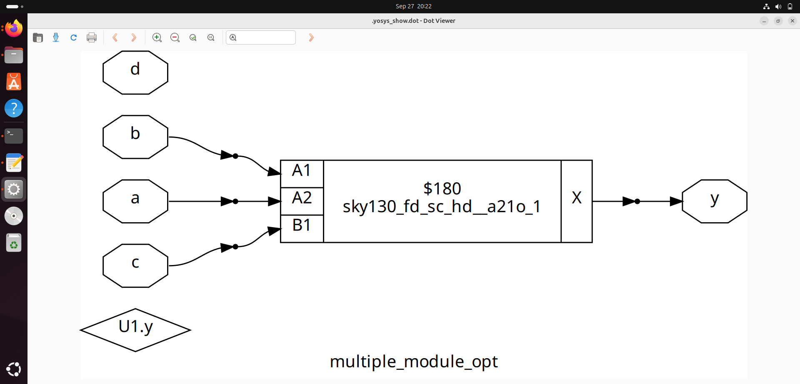
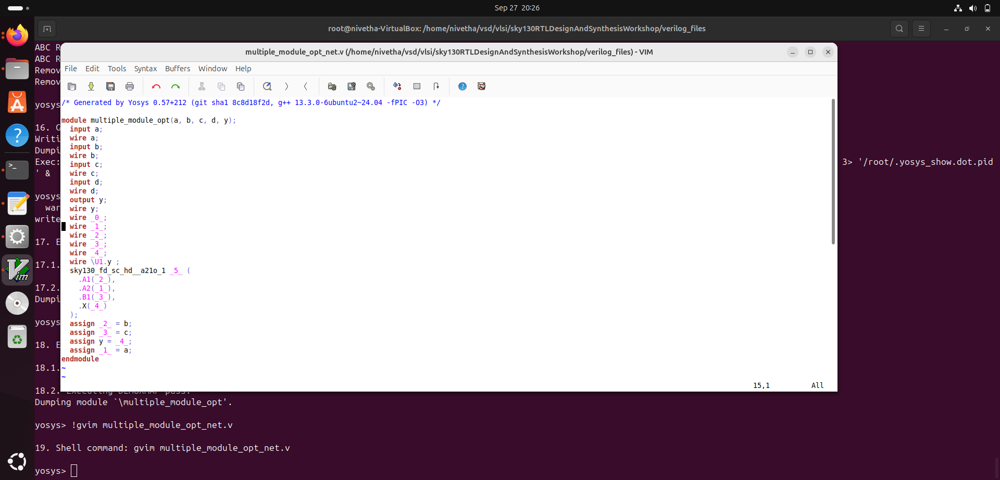
### Example 6: `multiple_module_opt2.v` (Constant Zero Circuit)

This example is a profound demonstration of **constant propagation** completely eliminating all logic.

```verilog
module sub_module(input a , input b , output y);
    assign y = a & b;
endmodule

module multiple_module_opt2(input a , input b , input c , input d , output y);
wire n1,n2,n3;

// U1: n1 = a & 1'b0 = 0
sub_module U1 (.a(a) , .b(1'b0) , .y(n1)); 
// U2: n2 = b & c
sub_module U2 (.a(b), .b(c) , .y(n2)); 
// U3: n3 = n2 & d
sub_module U3 (.a(n2), .b(d) , .y(n3));
// U4: y = n3 & n1 = n3 & 0 = 0
sub_module U4 (.a(n3), .b(n1) , .y(y)); 

endmodule
```

Because `n1` is permanently tied to $\mathbf{1'b0}$ (zero), the final output `y` is computed as $\text{something AND } 0$, which is always $\mathbf{1'b0}$. The entire circuit collapses to $\mathbf{y = 0}$. Inputs $a, b, c, d$ are irrelevant.

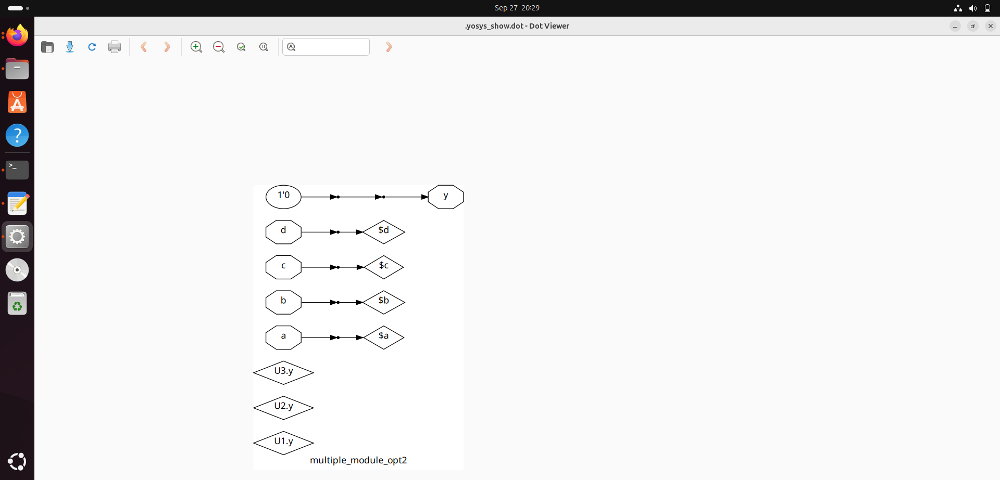
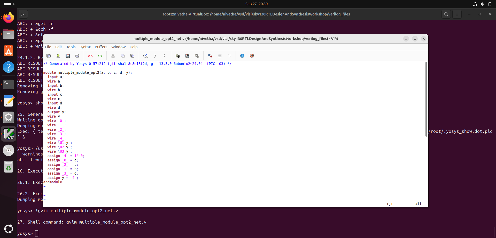

-----

## Sequential Logic Optimization

### Sequential Constant Propagation Lab

These five circuits likely demonstrate the basic concept of Sequential Constant Propagation, where Flip-Flops whose inputs are tied to a constant are eliminated or replaced with simpler logic.

The five circuit files are:

```bash
gvim dff_const1.v -o dff_const2.v -o dff_const3.v -o dff_const4.v -o dff_const5.v
```
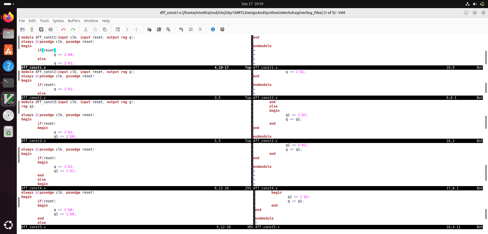

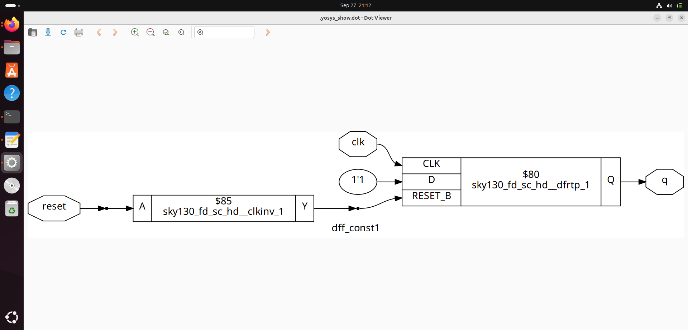
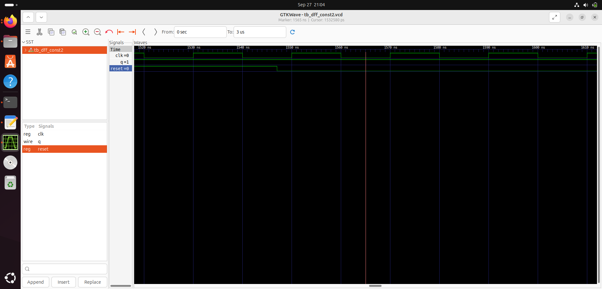
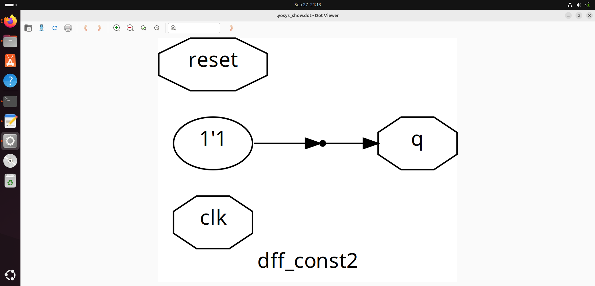
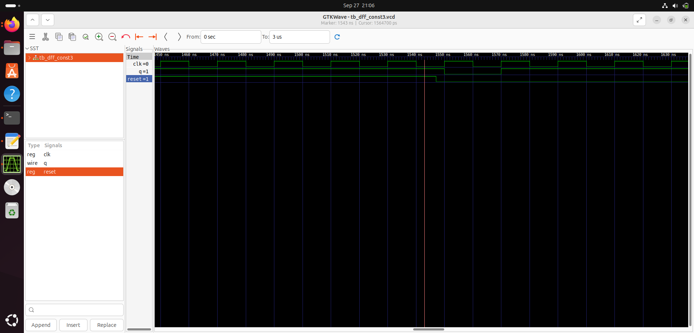


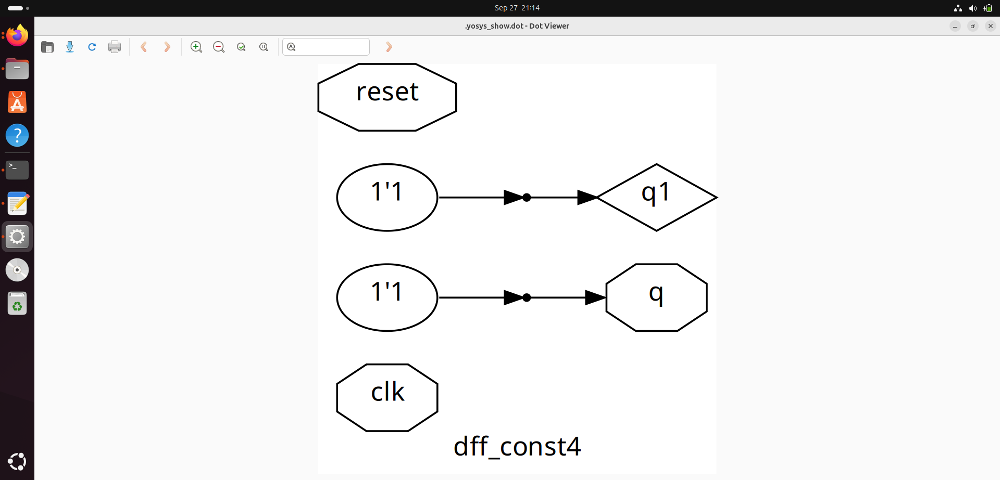

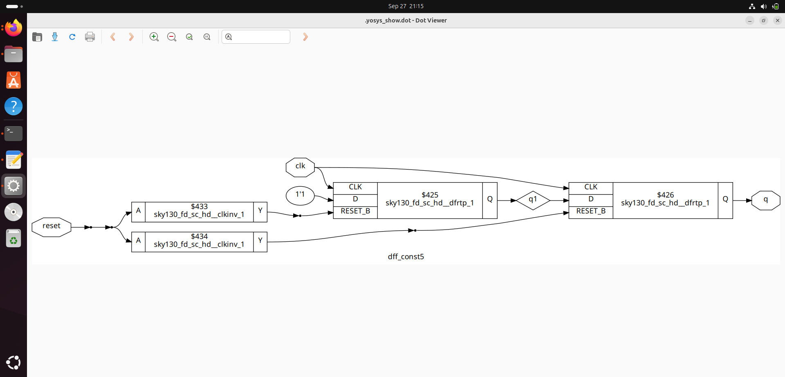
### Seq Optimization: Unused Logic Elimination

This demonstrates how a synthesis tool eliminates registers whose outputs do not ultimately affect a primary output or a memory element.

#### 1\. `counter_opt1.v`

The $3$-bit counter is simplified because only the LSB (`count[0]`) is used as a primary output.

```verilog
module counter_opt (input clk , input reset , output q);
reg [2:0] count;
assign q = count[0];

always @(posedge clk ,posedge reset)
begin
    if(reset)
        count <= 3'b000;
    else
        count <= count + 1;
end
endmodule
```

**Optimization Result:** Only one Flip-Flop is required (for `count[0]`). The registers for `count[1]` and `count[2]` and their associated logic are **eliminated** because their values do not affect `q`.

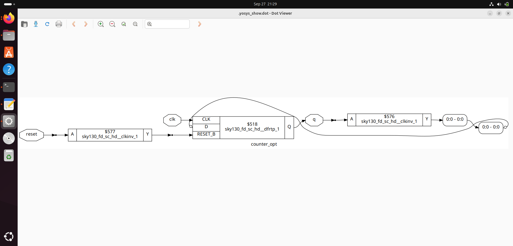

#### 2\. `counter_opt2.v`

The output depends on the comparison of all three bits, forcing all three registers to be retained.

```verilog
module counter_opt (input clk , input reset , output q);
reg [2:0] count;
assign q = (count[2:0] == 3'b100);

always @(posedge clk ,posedge reset)
begin
    if(reset)
        count <= 3'b000;
    else
        count <= count + 1;
end
endmodule
```

**Optimization Result:** The expression $q = (count[2:0] == 3'b100)$ is equivalent to $q = count[2] \cdot \neg count[1] \cdot \neg count[0]$. Since all bits are necessary for the primary output $q$, all three Flip-Flops are **retained** along with the final combinatorial logic for $q$.

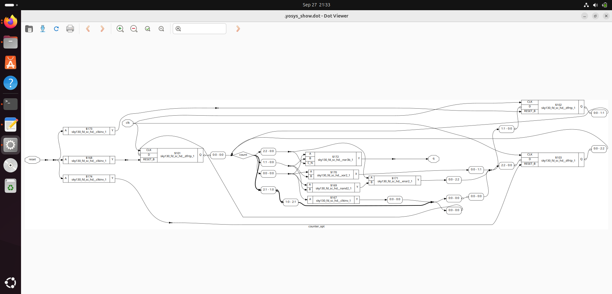


-----

