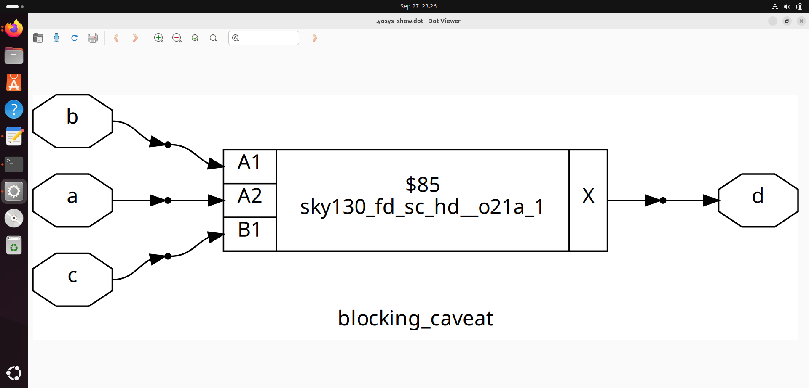

# Day 4: GLS, Blocking and Non-blocking, and Synthesis-Simulation Mismatch

This day focuses on validating the synthesized hardware (netlist) and understanding common coding pitfalls that cause the RTL simulation to differ from the Gate-Level Simulation.

-----

## 1\. Gate-Level Simulation (GLS)

**What is GLS?**
GLS is the process of simulating the design using the **netlist** (the structural gate-level representation) instead of the **RTL** (Register Transfer Level) code.

  * **Design Under Test (DUT):** The **netlist**, which is generated by the synthesis tool and contains only standard cells (AND, OR, DFF, etc.) and their connections.
  * **Logical Equivalence:** The netlist must be logically identical to the original RTL code. The **same testbench** used for RTL simulation must be used for GLS.

### Why GLS is Necessary

1.  **Verify Logical Correctness after Synthesis:** Ensures that the synthesis tool correctly mapped the abstract RTL logic to the physical standard cells without introducing errors.
2.  **Verify Timing:** GLS is often run with **delay annotation** (SDF—Standard Delay Format) to check if the circuit meets all timing requirements (setup and hold times) *after* physical cell placement and routing are considered. (This is known as **Static Timing Analysis** or timing simulation).

### GLS Setup with Icarus Verilog (Iverilog)

The GLS requires you to compile not just the netlist, but also the **Verilog models** for every standard cell used in that netlist.

**Design Example:** For $Y = (A \cdot B) + C$, the netlist will contain two instantiated cells: `and g1(...)` and `or g2(...)`. The gate-level models provide the functional (and sometimes timing) behavior for these cells.

**RTL Simulation Command:**

```bash
iverilog ternary_operator_mux.v tb_ternary_operator_mux.v
```

**GLS Command:**

```bash
iverilog ../my_lib/verilog_model/primitives.v ../my_lib/verilog_model/sky130_fd_sc_hd.v ternary_operator_mux_net.v tb_ternary_operator_mux.v
```

-----

## 2\. Synthesis-Simulation Mismatch

A mismatch occurs when the behavior observed in your RTL simulation does **not** match the behavior in the GLS (which represents the physical chip). This is typically caused by ambiguous or non-standard Verilog coding styles.

The three primary causes are:

1.  Missing Sensitivity List
2.  Blocking vs. Non-Blocking Assignments
3.  Non-standard Verilog Coding

### A. Missing Sensitivity List (Combinational Logic)

In combinational logic (`always @(...)` blocks), the sensitivity list must include all inputs to the block.

  * **Problematic RTL (Missing Inputs):**

    ```verilog
    module(input i0,input i1,input sel,output reg y);
    always @(sel) // Only sensitive to 'sel'
    begin 
    if(sel) y=i0;
    else y=i1;
    end
    endmodule
    ```

    **Simulation Mismatch:** If `i0` or `i1` change, the output `y` **does not update** until `sel` changes. The synthesized hardware (a physical MUX) updates immediately, causing a mismatch.

  * **Correct RTL (Standard for all inputs):**

    ```verilog
    module(input i0,input i1,input sel,output reg y);
    always @(i0 or i1 or sel) // Standard Verilog
    begin
    if(sel) y=i0;
    else y=i1;
    end
    endmodule
    // OR, preferably: always @(*)
    ```

    **Correct Behavior:** Any change in `i0`, `i1`, or `sel` immediately reflects in `y`, matching the hardware.

### B. Blocking (`=`) vs. Non-Blocking (`<=`) Assignments

  * **Blocking (`=`):**

      * **Execution Flow:** Executes statements **sequentially**, blocking the execution of the next statement until the current one is complete.
      * **Recommended Use:** **Combinational Logic** (`always @(*)`)

  * **Non-Blocking (`<=`):**

      * **Execution Flow:** All Right-Hand Sides (RHS) are evaluated in **parallel** at the start of the block, and the assignments to Left-Hand Sides (LHS) occur simultaneously at the end of the block.
      * **Recommended Use:** **Sequential Logic** (`always @(posedge clk)`)

#### The Blocking Caveat Lab

This example illustrates a **combinational logic error** caused by using the **blocking assignment** in a way that doesn't map correctly to physical logic.

```verilog
module blocking_caveat (input a , input b , input  c, output reg d); 
reg x;
always @ (*)
begin
    d = x & c;  // Statement 1
    x = a | b;  // Statement 2
end
endmodule
```

**Mismatch Analysis:**

1.  **RTL Simulation (Blocking):** Statement 1 uses the **old value** of `x` to calculate `d` before Statement 2 calculates the new `x`. The output `d` exhibits a **one-delta-cycle delay**.
2.  **Synthesis (Hardware):** Synthesis maps the logic to pure **parallel** gates. The hardware calculates `d` directly based on the *current* inputs without the sequential delay.

**Conclusion:** The RTL code shows a delayed output for `d`, while the GLS (hardware) shows an immediate output, causing a critical mismatch.

#### Lab Command Lines

```bash
# Setup files
gvim ternary_operator_mux.v -o bad_mux.v -o good_mux.v

# Ternary Mux RTL Simulation
iverilog ternary_operator_mux.v tb_ternary_operator_mux.v
./a.out
gtkwave tb_ternary_operator_mux.vcd

# Ternary Mux GLS
iverilog ../my_lib/verilog_model/primitives.v  ../my_lib/verilog_model/sky130_fd_sc_hd.v ternary_operator_mux_net.v tb_ternary_operator_mux.v
./a.out
gtkwave tb_ternary_operator_mux.vcd

# Bad Mux GLS
iverilog ../my_lib/verilog_model/primitives.v  ../my_lib/verilog_model/sky130_fd_sc_hd.v bad_mux_net.v tb_bad_mux.v
./a.out
gtkwave bad_mux.vcd
# Note: No mismatch observed in this lab due to advanced Yosys optimization.

# Blocking Caveat RTL Simulation (Shows delay)
iverilog blocking_caveat.v tb_blocking_caveat.v
./a.out
gtkwave tb_blocking_caveat.v

# Blocking Caveat GLS (Shows immediate update - the mismatch)
iverilog ../my_lib/verilog_model/primitives.v  ../my_lib/verilog_model/sky130_fd_sc_hd.v blocking_caveat_net.v tb_blocking_caveat.v
./a.out
gtkwave tb_blocking_caveat.v
```

**Observation:** We clearly see the mismatch in the waveforms for the `blocking_caveat` design between the RTL (delayed 'd') and the GLS (immediate 'd').





