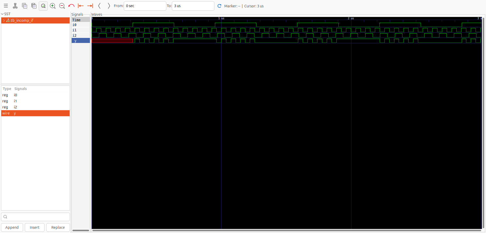

# Week 1, Day 5: Optimization in Synthesis

This day focuses on best practices for Verilog behavioral modeling to ensure efficient and intended hardware synthesis, specifically covering **inferred latches** and utilizing iteration constructs like `for` and `generate`.

-----

## Conditional Execution: `if-else` Statements

`if-else` statements are used for **conditional execution** in behavioral modeling, typically within procedural blocks (`always`, `initial`).

### Syntax

```verilog
if (condition_1) begin
    // Statement(s)
end else if (condition_2) begin
    // Statement(s)
end else begin
    // Statement(s)
end
```

-----

## Inferred Latches in Verilog

An **inferred latch** occurs when a synthesis tool is unable to assign a value to a variable for all possible input combinations. To maintain the unassigned value, the tool automatically infers a **transparent latch** (level-sensitive memory element). This is usually unintended in combinational logic.

### Lab Example: Incomplete `if` Statement (LATCH INFERRED)

```verilog
module incomp_if (input i0 , input i1 , input i2 , output reg y);
always @ (*)
begin
	if(i0)
		y <= i1;
end
endmodule
```

### Lab Example: Nested Incomplete `if-else` (LATCH INFERRED)

```verilog
module incomp_if2 (input i0 , input i1 , input i2 , input i3, output reg y);
always @ (*)
begin
	if(i0)
		y <= i1;
	else if (i2)
		y <= i3;
end
endmodule
```


### Complete `case` Statement (No Latch)

The solution for combinational logic is adding a `default` case or assigning a default value at the start of the `always @(*)` block.

```verilog
module comp_case (input i0 , input i1 , input i2 , input [1:0] sel, output reg y);
always @ (*)
begin
	case(sel)
		2'b00 : y = i0;
		2'b01 : y = i1;
		default : y = i2;
	endcase
end
endmodule
```


### Bad Case (Wildcard)

```verilog
module bad_case (input i0 , input i1, input i2, input i3 , input [1:0] sel, output reg y);
always @(*)
begin
	case(sel)
		2'b00: y = i0;
		2'b01: y = i1;
		2'b10: y = i2;
		2'b1?: y = i3;
		//2'b11: y = i3;
	endcase
end

endmodule
```

**Reason:** Using **wildcards (`?`)** can lead to priority encoding or non-portable synthesis results. For explicit MUX logic, listing all states (`00`, `01`, `10`, `11`) or using `default` is better.  


### Partial Assignment in Case (LATCH INFERRED for `x`)

```verilog
module partial_case_assign (input i0 , input i1 , input i2 , input [1:0] sel, output reg y , output reg x);
always @ (*)
begin
	case(sel)
		2'b00 : begin
			y = i0;
			x = i2;
			end
		2'b01 : y = i1; // x is not assigned here
		default : begin
			x = i1;
			y = i2;
			end
	endcase
end
endmodule
```

**Explanation:** A **latch is inferred for output `x`** because it is not assigned a value when `sel` is `2'b01`. The variable `x` must hold its previous value in that case.  


-----

## Iteration and Replication Constructs

### `for` Loop in Verilog

  * Used within procedural blocks to execute statements multiple times.
  * **Synthesizable only if the number of iterations is fixed at compile time** (used for hardware replication).

### `generate` Blocks in Verilog

  * Used to create hardware structures (module instances or logic) at **compile time** (elaboration).
  * Requires the special iteration variable **`genvar`**.

### Hardware Structure: Ripple Carry Adder (RCA)

An RCA adds binary numbers using a chain of **full adders (FA)**. The carry-out of each stage connects to the carry-in of the next stage.
  

-----

## Synthesis Labs: `for` Loop and `generate`

### 4:1 MUX using `for` loop

```verilog
module mux_generate (input i0 , input i1, input i2 , input i3 , input [1:0] sel , output reg y);
wire [3:0] i_int;
assign i_int = {i3,i2,i1,i0};
integer k;
always @ (*)
begin
for(k = 0; k < 4; k=k+1) begin
	if(k == sel)
		y = i_int[k];
end
end
endmodule
```
    

---  

### 8:1 DEMUX using `case`

```verilog
module demux_case (output o0 , output o1, output o2 , output o3, output o4, output o5, output o6 , output o7 , input [2:0] sel , input i);
reg [7:0]y_int;
assign {o7,o6,o5,o4,o3,o2,o1,o0} = y_int;
integer k;
always @ (*)
begin
y_int = 8'b0;
	case(sel)
		3'b000 : y_int[0] = i;
		3'b001 : y_int[1] = i;
		3'b010 : y_int[2] = i;
		3'b011 : y_int[3] = i;
		3'b100 : y_int[4] = i;
		3'b101 : y_int[5] = i;
		3'b110 : y_int[6] = i;
		3'b111 : y_int[7] = i;
	endcase

end
endmodule
```
    

---
### 8:1 DEMUX using `for` loop

```verilog
module demux_generate (output o0 , output o1, output o2 , output o3, output o4, output o5, output o6 , output o7 , input [2:0] sel , input i);
reg [7:0]y_int;
assign {o7,o6,o5,o4,o3,o2,o1,o0} = y_int;
integer k;
always @ (*)
begin
y_int = 8'b0;
for(k = 0; k < 8; k++) begin
	if(k == sel)
		y_int[k] = i;
end
end
endmodule
```
  

---

### 8-bit Ripple Carry Adder with `generate` Block

#### Full Adder Module:

```verilog
module fa (input a, input b, input c, output co, output sum);
    assign {co, sum} = a + b + c;
endmodule
```

#### Ripple Carry Adder Module:

```verilog
module rca (input [7:0] num1 , input [7:0] num2 , output [8:0] sum);
wire [7:0] int_sum;
wire [7:0]int_co;

genvar i;
generate
	for (i = 1 ; i < 8; i=i+1) begin
		fa u_fa_1 (.a(num1[i]),.b(num2[i]),.c(int_co[i-1]),.co(int_co[i]),.sum(int_sum[i]));
	end
endgenerate

fa u_fa_0 (.a(num1[0]),.b(num2[0]),.c(1'b0),.co(int_co[0]),.sum(int_sum[0]));

assign sum[7:0] = int_sum;
assign sum[8] = int_co[7];
endmodule
```
  

-----

## Summary

Day 5 focused on writing **synthesis-friendly Verilog** by:

1.  **Avoiding Inferred Latches:** Ensuring all outputs are assigned in all conditional paths.
2.  **Using `for` Loops:** Leveraging behavioral `for` loops inside `always @(*)` to describe repetitive combinational structures (like MUXes).
3.  **Using `generate` Blocks:** Utilizing `generate for` loops to instantiate multiple structural components (like Full Adders) to build scalable hardware (like the RCA).


-----

**Acknowledgement:** Always add the acknowledgement.
